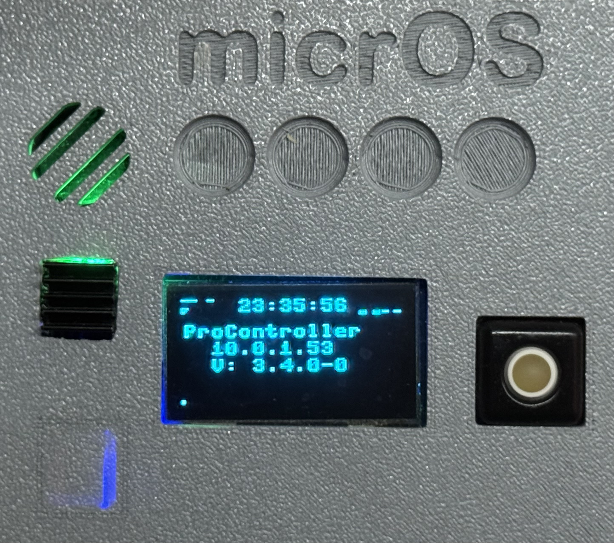
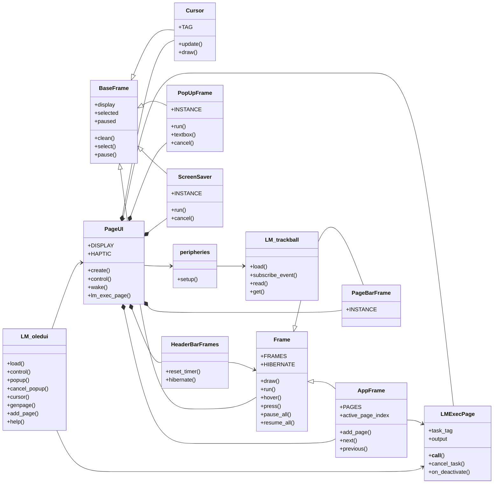
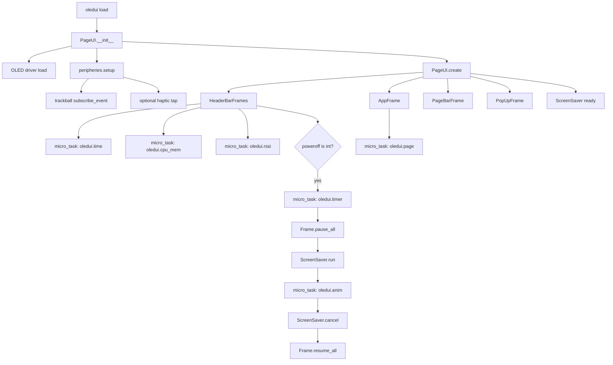
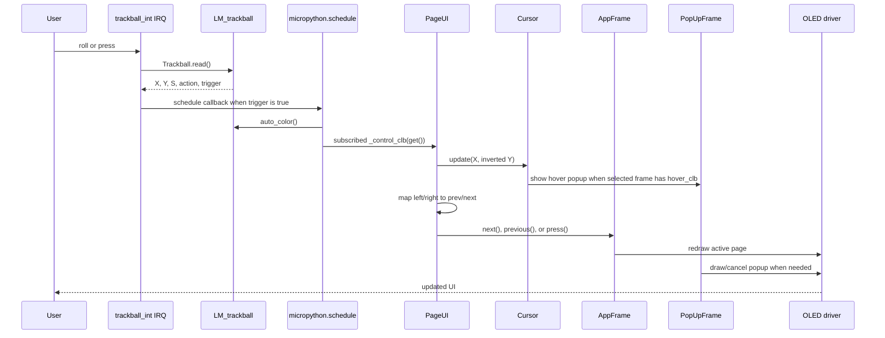
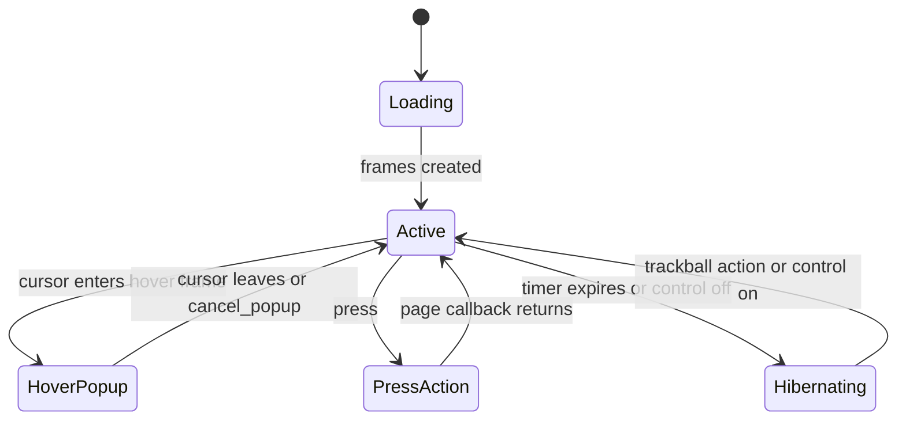

# micrOS Application: async_oledui

Async OLED UI framework for micrOS. It provides page rendering, cursor control,
popups, power-save handling, and trackball-driven navigation for SSD1306 and
SH1106 displays.



This package follows the micrOS Load Module model described in
[MODULE_GUIDE.md](../../MODULE_GUIDE.md): `LM_oledui.py` exposes the command
surface, while the `async_oledui` package contains reusable UI frame classes.

## Install

```bash
pacman install "github:BxNxM/micrOSPackages/async_oledui"
```

```bash
pacman upgrade "async_oledui"
pacman uninstall "async_oledui"
```

## Device Layout

- Load module: `/modules/LM_oledui.py`
- Package files: `/lib/async_oledui`
- Package manifest: `/lib/async_oledui/pacman.json`

## Quick Start

Initialize the trackball first when hardware navigation is used. This creates
the trackball IRQ handler; `oledui load` then subscribes the UI callback.

```commandline
trackball load width=127 height=63 irq_sampling=50 sensitivity=5
oledui load width=128 height=64 oled_type='sh1106' control='trackball' poweroff=30 haptic=False
```

Minimal display-only startup:

```commandline
oledui load control=None poweroff=None
```

Manual control commands:

```commandline
oledui control cmd=next
oledui control cmd=prev
oledui control cmd=press
oledui control cmd=off
oledui control cmd=on
```

Utility commands:

```commandline
oledui cursor x=20 y=40
oledui popup msg='Hello micrOS'
oledui cancel_popup
oledui genpage cmd='system clock'
oledui genpage cmd='system info &' run=False
oledui debug state=True
```

[Generated command documentation](https://htmlpreview.github.io/?https://github.com/BxNxM/micrOS/blob/master/micrOS/client/sfuncman/sfuncman.html#oledui)

## Public LM API

| Command | Purpose |
| --- | --- |
| `load` | Creates the singleton `PageUI`, initializes the OLED driver, subscribes optional controls, creates frames, and starts frame refresh tasks. |
| `control` | Sends `next`, `prev`, `press`, `off`, or `on` to the UI. Shell control forces page switching. |
| `popup` | Draws a modal textbox and pauses the app frame while it is visible. |
| `cancel_popup` | Clears the popup and resumes the app frame. |
| `cursor` | Moves the virtual cursor and updates frame hover selection. |
| `genpage` | Adds a page that executes a micrOS command, either on press or during every page refresh, then redraws the footer page indicator. |
| `add_page` | Adds a custom page callback from another Load Module or package code and refreshes the footer when the UI is active. |
| `debug` | Toggles frame-border debug drawing. |
| `help` | Returns the command list through `Types.resolve(...)` for micrOS UI generation. |

`oledui load` is idempotent. The first call creates the UI; later calls return
`PageUI was already created`.

## Architecture

`LM_oledui.py` is intentionally small at the public boundary. Most behavior is
owned by the package classes in `async_oledui/uiframes.py`.



## Async Task Model

Each refreshable frame owns one micrOS `micro_task` tag. Tasks draw only their
own frame rectangle, then call `my_task.feed(...)` so the micrOS scheduler and
watchdog stay healthy.

| Task tag | Frame / owner | Current period | Change timing in | Hover popup | Press action |
| --- | --- | --- | --- | --- | --- |
| `oledui.time` | `HeaderBarFrames` / tag `time` | 1000 ms | `HeaderBarFrames.__init__()`, `time_frame.run(...)` | Yes, shows uptime through `_time_hover()` | No |
| `oledui.cpu_mem` | `HeaderBarFrames` / tag `cpu_mem` | 2100 ms | `HeaderBarFrames.__init__()`, `cpu_mem_frame.run(...)` | Yes, shows CPU, memory, and optional ESP32 temperature through `_cpu_mem_hover()` | No |
| `oledui.rssi` | `HeaderBarFrames` / tag `rssi` | 4200 ms | `HeaderBarFrames.__init__()`, `rssi_frame.run(...)` | Yes, shows STA RSSI or AP stations through `_rssi_hover()` | No |
| `oledui.timer` | `HeaderBarFrames` / tag `timer` | `poweroff * 1000 / 24` ms | `HeaderBarFrames.__init__()`, `timer_frame.run(...)`; user value comes from `oledui load poweroff=<sec>` | Yes, shows remaining power-off seconds through `_timer_hover()` | No |
| `oledui.page` | `AppFrame` / tag `app` | 900 ms | `PageUI.create()`, `self.app_frame.run("page", period_ms=900)` | No built-in hover popup | Yes, if active page returns `{"press": callback}`; `genpage run=False` uses this |
| `oledui.anim` | `ScreenSaver` | 100 ms at default `fps=10` | `ScreenSaver.run(fps=10)`, period is `1000 / fps` | No | No |

`Frame._task(...)` enforces a 50 ms minimum sleep chunk. Shorter configured
periods are clamped to 50 ms, and longer periods are split into 50 ms feeds so
the micrOS event loop and watchdog continue to run.

Non-periodic UI redraw paths:

| UI part | Redraw trigger | Popup / press behavior | Change behavior in |
| --- | --- | --- | --- |
| `PageBarFrame` / footer | Initial UI creation, `next`, `previous`, and every successful `add_page` / `genpage` | No popup; cursor on footer enables trackball `left` / `right` page switching | `PageUI.create()`, `PageUI.control()`, `PageUI.add_page()` |
| `PopUpFrame` | Hover callback, `oledui popup`, `cancel_popup`, or `press` cancel | Active popup pauses `AppFrame`; pressing first cancels popup, then runs active page press | `PopUpFrame.run()`, `PopUpFrame.textbox()`, `PageUI.control("press")` |
| `Cursor` | Trackball events or `oledui cursor` | Selects frame tags and opens hover popup when selected frame has `hover_clb` | `Cursor.update()` and `PageUI._control_clb()` |
| `LMExecPage` command pages | `genpage`; drawn by `oledui.page` refresh | `run=False` creates a press callback; `run=True` executes on each page refresh | `LMExecPage` and `PageUI.lm_exec_page()` |



## Event Flow

The trackball module owns the hardware interrupt. The UI subscribes a callback
through `async_oledui.peripheries.setup(...)`.



Action mapping:

| Input action | UI behavior |
| --- | --- |
| `left` | Maps to `prev`; switches page only when the cursor is on the footer. |
| `right` | Maps to `next`; switches page only when the cursor is on the footer. |
| `up` / `down` | Moves cursor and updates hover selection. |
| `press` | Cancels an active popup first, then invokes the active page press callback if one exists. |
| `off` | Pauses all frame tasks and starts the screen saver. |
| `on` | Cancels the screen saver, resumes all frames, and powers on the display. |

Shell commands such as `oledui control cmd=next` call `PageUI.control(...,
force=True)`, so manual `next`/`prev` switches pages even when the cursor is not
on the footer.

## UI State



## Page Callback Contract

Custom pages are simple draw callbacks:

```python
def my_page(display, w, h, x, y):
    display.text("hello", x, y)
    return True
```

To handle a press event, return a dictionary with a `press` callback. The press
callback receives the same display frame arguments.

```python
def my_page(display, w, h, x, y):
    display.text("press me", x, y)

    def on_press(display, w, h, x, y):
        display.text("pressed", x, y + 12)

    return {"press": on_press}
```

Register the page from another Load Module or package file:

```python
from LM_oledui import add_page

def load():
    add_page(my_page)
    return True
```

Page callbacks should be quick and allocation-light. For slow work, use a
background micrOS command with `genpage`, or create a dedicated `micro_task` and
draw cached state from the page callback.

## Command Pages

`genpage` turns an existing micrOS command into a UI page:

```commandline
oledui genpage cmd='system clock'
```

By default, the command is executed when the page is pressed. With `run=True`,
the command is executed on each `oledui.page` refresh.

Background commands are detected when the command ends with `&` or `>>`. Each
generated command page owns its task tag and output cache, reads output through
`manage_task(tag, 'show')`, and cancels an unfinished task when the page is
deactivated by `next` or `previous`.

```commandline
oledui genpage cmd='system info &' run=False
```

Keep command strings simple. `genpage` currently splits the command with
`cmd.strip().split()`, so arguments containing spaces are better handled by a
small custom page callback.

## Dependencies

Package-level `package.json` does not declare external mip dependencies. The UI
expects these micrOS built-ins or optional Load Modules to be available on the
device:

```text
LM_system
LM_oled or LM_oled_sh1106
LM_trackball      optional hardware control
LM_haptic         optional haptic feedback
LM_gameOfLife     optional screen saver animation
LM_esp32          optional CPU temperature in hover popup
```

Required pin map entries for trackball control:

```text
i2c_scl
i2c_sda
trackball_int
```

Use the trackball pin helper to inspect wiring:

```commandline
trackball pinmap
```

## Development Notes

- Keep `LM_oledui.py` as the stable public API and put reusable UI behavior in
  `async_oledui/uiframes.py`.
- Keep page rendering non-blocking; all periodic rendering should flow through
  `micro_task`.
- Preserve the existing command names from `help(widgets=False)` because they
  are exposed through ShellCli, REST/WebCli, and generated dashboards.
- Import optional hardware modules lazily, as done in `peripheries.py`, to keep
  display-only startup light.
- Do not edit generated files under `toolkit/workspace/` when changing this
  package.
