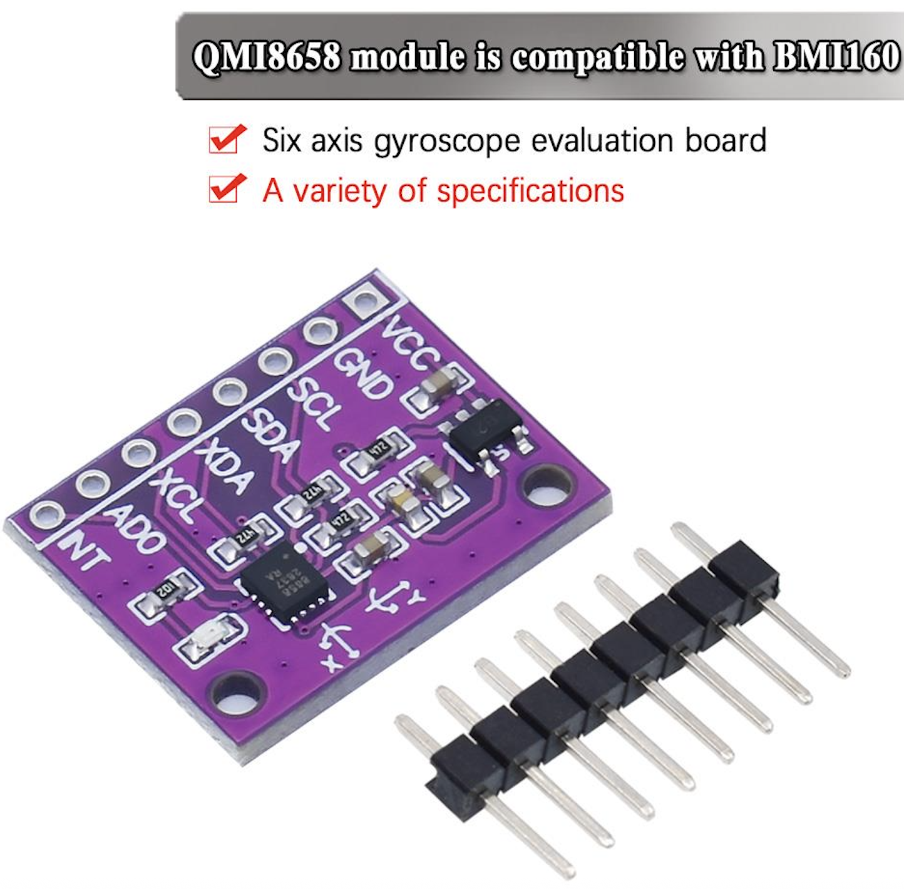

# micrOS Application: gyro



Gyroscope/IMU package for micrOS. It exposes acceleration, gyroscope, and
temperature readings from the QMI8658/QMI8658C motion sensor over the standard
micrOS Load Module command surface.

## Install

```bash
pacman install "github:BxNxM/micrOSPackages/gyro"
```

```bash
pacman upgrade "gyro"
pacman uninstall "gyro"
```

## Device Layout

- Package files: `/lib/gyro`
- Load module: `/modules/LM_qmi8658.py`
- Package manifest: `/lib/gyro/pacman.json`

## Wiring

The module uses the shared logical I2C pins:

```text
i2c_scl
i2c_sda
```

Inspect the active board mapping with:

```commandline
qmi8658 pinmap
```

`i2c discover` also labels address `0x6b` as `QMI8658`.

## Usage

```commandline
qmi8658 load i2c_sda=None i2c_scl=None
qmi8658 temperature
qmi8658 acceleration
qmi8658 gyro
qmi8658 measure
qmi8658 pinmap
```

`measure` returns all values together:

```json
{"temp": 0.12, "accel": [0.0, 0.0, 1.0], "gyro": [0.0, 0.0, 0.0]}
```

The host dashboard app `QMI8685_GYRO.py` reads the sensor with:

```commandline
qmi8658 measure >json
```

[documentation](https://htmlpreview.github.io/?https://github.com/BxNxM/micrOS/blob/master/micrOS/client/sfuncman/sfuncman.html#external-modules)

## Dependencies

Dependencies are auto installed by `mip` based on `package.json`.

```text
n/a
```
