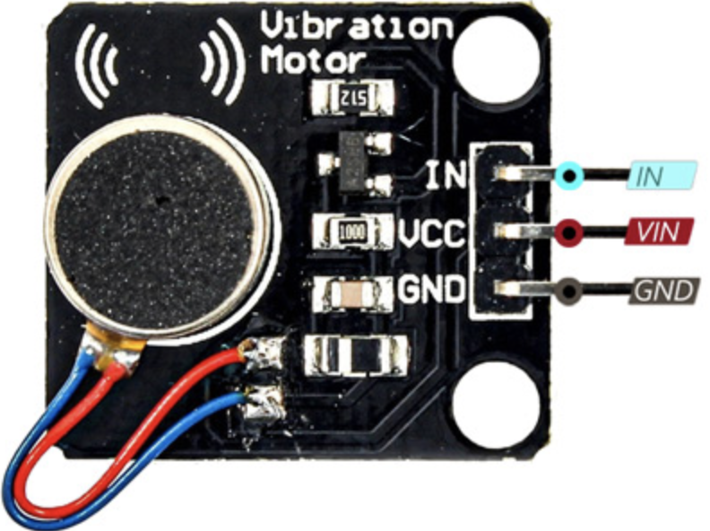

# micrOS Application: haptic



PWM haptic feedback driver for micrOS. It controls a small vibration motor with
simple tap and effect helpers, and can be used directly from ShellCli/WebCli or
as optional feedback for other packages such as `async_oledui`.

## Install

```bash
pacman install "github:BxNxM/micrOSPackages/haptic"
```

```bash
pacman upgrade "haptic"
pacman uninstall "haptic"
```

## Device Layout

- Package files: `/lib/haptic`
- Load module: `/modules/LM_haptic.py`
- Package manifest: `/lib/haptic/pacman.json`

## Wiring

The module uses the logical `haptic` pin. Inspect the active board mapping with:

```commandline
haptic pinmap
```

For example, `IO_tinypico.py` maps `haptic` to GPIO 32.

## Usage

```commandline
haptic load
haptic load intensity=high
haptic tap
haptic effect1
haptic effect2
haptic gen intensity=700 wait=200 stop_wait=100 repeat=2
haptic deinit
haptic pinmap
```

`intensity` can be `low` or `high` for `load()`. The generated effect accepts a
PWM duty value through `intensity`, typically in the 600-1000 range.

[documentation](https://htmlpreview.github.io/?https://github.com/BxNxM/micrOS/blob/master/micrOS/client/sfuncman/sfuncman.html#external-modules)

## Dependencies

Dependencies are auto installed by `mip` based on `package.json`.

```text
n/a
```
