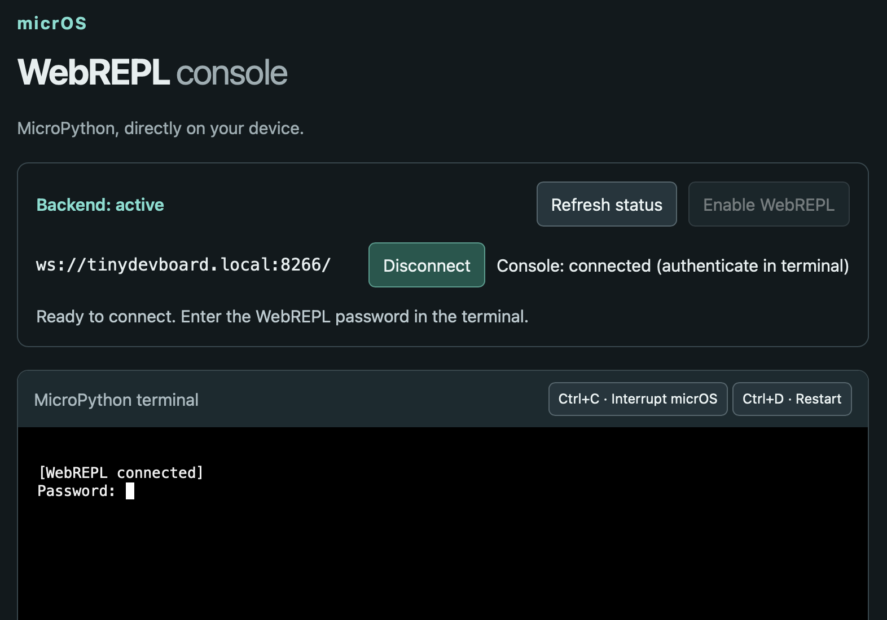

# uwebrepl



A small, device-hosted MicroPython WebREPL console for micrOS. Open the page,
check whether the backend is active, enable it with your device password, then
connect and use the same terminal widget as DevToolKit's official WebREPL client.

## Install and open

After this package is published to the registry:

```text
pacman install "github:BxNxM/micrOSPackages/uwebrepl"
uwebrepl load
```

Open `http://<device-ip>/uwebrepl`. The micrOS web server must be enabled
(`webui` configuration); registration alone does not start the HTTP server.
For local development before publication, run `python3 tools.py -s` from the
packages directory and install `http://<computer-ip>:8000/uwebrepl/package.json`
with `pacman install` instead.

1. The page reads the real backend listener and shows **active**, **inactive**,
   **unavailable in this firmware**, or **status unavailable** if HTTP fails.
2. **Enable WebREPL** uses micrOS's normal `auth.js` password challenge and
   `@sudo` protection. It starts the existing firmware WebREPL server with
   `appwd`, without rebooting. An already-active listener is left alone.
3. **Connect** opens `ws://<same-device>:8266/`, matching micrOS core's WebREPL
   port. A custom listener port is detected only on firmware exposing
   `socket.getsockname()`; ESP32/lwIP firmware must use the standard 8266 port.
   Enter the WebREPL password in the terminal when prompted. The WebSocket
   connection and the backend listener have separate status indicators;
   a connected socket does not imply successful password authentication.
4. **Disconnect** closes only this browser connection. Use `uwebrepl disable`
   to stop the backend. **Refresh status** reads it again; there is no polling
   task consuming device resources.

Loading the module or opening the page never enables WebREPL automatically.
Backend activation lasts until reboot unless some other boot configuration
starts WebREPL. Add `uwebrepl load` to an existing `boothook` to restore the
page/API registration after reboot; preserve the other commands in that hook.

## Commands and endpoints

```text
uwebrepl load
uwebrepl status
uwebrepl enable pwd='<appwd>'
uwebrepl disable pwd='<appwd>'
uwebrepl help
```

| Endpoint | Method | Behavior |
| --- | --- | --- |
| `/uwebrepl` | GET | Static console page |
| `/uwebrepl/status` | GET | `{available, active, port}`; never returns a password |
| `/uwebrepl/enable` | POST | Password-protected activation; status or `{error}` |

Use the POST endpoint and `x-micros-auth` for browser activation. The normal
LM shell functions also enforce `@sudo`; the `/rest` bridge does not provide
the interactive HTTP authentication retry flow.

## Console behavior

This is the actual MicroPython REPL, not the micrOS command shell. While the
application is running, the terminal can display runtime output. **Ctrl+C**
interrupts micrOS to reach `>>>`, and can stop automation tasks and the HTTP
server. Keep the already-loaded page open; WebREPL can remain connected when
HTTP status requests no longer work. **Ctrl+D**, at the Python prompt,
soft-reboots the device. Reload the module endpoints after reboot if they are
not in the boot hook.

Arrow keys, backspace, ANSI output and control keys use the official terminal.
Paste with Ctrl+A then Ctrl+V (Cmd+V on macOS). Only one WebREPL client can
connect at a time, so close the DevToolKit/OTA client before connecting here.
The existing listener may use a different password if another tool started it.

Serve the page over HTTP on your local device network: MicroPython's plain
WebSocket listener cannot be opened from an HTTPS page. The console does not
save passwords or send them in URLs. Like upstream WebREPL, traffic is plain
text and the authenticated terminal has full device access.

The first version focuses on the console; file-transfer controls are not
included. The existing micrOS fileserver and DevToolKit remain available for
file management. No recovery-mode switch, runtime core changes, additional
WebSocket server, browser framework, CDN or package dependencies are needed.

## Layout and footprint

- `/modules/LM_uwebrepl.py`: small lazy backend adapter and web registration.
- `/web/uwebrepl/`: console HTML/CSS/JS and the compacted terminal widget.
- `/lib/uwebrepl/pacman.json`: lifecycle receipt for upgrade/uninstall.
- `/auth.js`: reused from the installed micrOS web assets.

The browser runs all terminal rendering. micrOS streams static assets through
its existing file server; the LM does not read the terminal bundle into RAM.
The four browser assets total about 76 KiB, with no external asset requests.
The firmware must include the standard MicroPython `webrepl` implementation
with `listen_s`, `start()` and `stop()`; the host simulator stub is not a
functional WebREPL backend. Status uses a non-blocking `select.poll()` probe
because upstream `stop()` can leave a closed socket object behind. It handles
idle/readable listeners and error/hangup/invalid-socket events without accepting
connections or changing WebREPL's callback. It does not require CPython socket
methods such as `getsockname()` or `fileno()`.

`vendor/term.js` is the unmodified terminal bundled with DevToolKit under
`toolkit/workspace/webrepl/term.js`, from
[micropython/webrepl](https://github.com/micropython/webrepl). It retains its
upstream MIT copyright and permission header. Rebuild its compact device copy
with `python3 build_terminal.py` (host dependency: `rjsmin`). The package never
modifies DevToolKit's bundled files. Protocol reference:
[MicroPython WebREPL](https://github.com/micropython/webrepl#technical-details).

## Validation

```sh
python3 build_terminal.py
python3 ../tools.py -u uwebrepl
python3 ../tools.py -v uwebrepl
python3 -m pytest tests
UWEBREPL_BROWSER_TESTS=1 python3 -m pytest tests/test_browser.py
```

Host tests cover real micrOS authentication, endpoint registration, external
listeners, idempotent activation, closed sockets, unsupported firmware and
startup failures. Run them in the micrOS checkout (they reuse `Auth.py`). The
optional browser tests require Playwright and Chromium and mock device HTTP
and WebSocket traffic; they cover authentication, terminal input/output,
reconnect, HTTP loss, HTTPS blocking and mobile layout.
Device verification should cover enabling, login, output,
editing, Ctrl+C/Ctrl+D, reconnect and free heap on the intended board.
